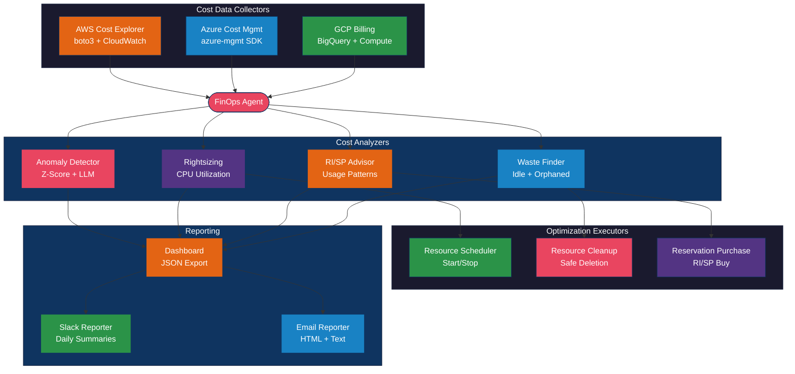

# AI FinOps Optimization Agent

A Python agent that analyzes cloud costs across AWS, Azure, and GCP, identifies optimization opportunities including rightsizing, reserved instances, and waste elimination, and can execute recommendations with built-in safety controls.

## Architecture



## Prerequisites

| Requirement | Version | Notes |
|---|---|---|
| Python | >= 3.11 | Required for modern type hints |
| pip | >= 23.0 | For dependency installation |
| AWS credentials | - | For AWS cost analysis (boto3-compatible) |
| Azure credentials | - | For Azure cost analysis (service principal) |
| GCP credentials | - | For GCP cost analysis (service account) |
| OpenAI API key | - | For LLM-powered anomaly explanations |

## Installation

```bash
# Clone the repository
git clone https://github.com/your-org/ai-finops-optimization-agent.git
cd ai-finops-optimization-agent

# Create and activate a virtual environment
python -m venv .venv
source .venv/bin/activate  # On Windows: .venv\Scripts\activate

# Install with specific cloud provider support
pip install -e ".[aws]"           # AWS only
pip install -e ".[azure]"         # Azure only
pip install -e ".[gcp]"           # GCP only
pip install -e ".[all-clouds]"    # All providers
pip install -e ".[all-clouds,dev]"  # All providers + dev tools

# Configure environment variables
cp .env.example .env
# Edit .env with your cloud credentials and API keys
```

## Configuration

### Environment Variables

| Variable | Required | Default | Description |
|---|---|---|---|
| `OPENAI_API_KEY` | Yes | - | OpenAI API key for anomaly explanations |
| `FINOPS_PROVIDERS` | No | `aws` | Comma-separated: `aws`, `azure`, `gcp` |
| `AWS_ACCESS_KEY_ID` | No | - | AWS access key (or use IAM role/profile) |
| `AWS_SECRET_ACCESS_KEY` | No | - | AWS secret key |
| `AWS_DEFAULT_REGION` | No | `us-east-1` | Default AWS region |
| `AZURE_SUBSCRIPTION_ID` | No | - | Azure subscription ID |
| `AZURE_TENANT_ID` | No | - | Azure AD tenant ID |
| `AZURE_CLIENT_ID` | No | - | Azure service principal client ID |
| `AZURE_CLIENT_SECRET` | No | - | Azure service principal secret |
| `GCP_PROJECT_ID` | No | - | GCP project ID |
| `GCP_BILLING_ACCOUNT_ID` | No | - | GCP billing account ID |
| `GOOGLE_APPLICATION_CREDENTIALS` | No | - | Path to GCP service account JSON |
| `SLACK_WEBHOOK_URL` | No | - | Slack webhook for cost reports |
| `SMTP_HOST` | No | - | SMTP server for email reports |

### FinOpsConfig Options

| Parameter | Type | Default | Description |
|---|---|---|---|
| `enabled_providers` | `list[CloudProvider]` | `[AWS]` | Cloud providers to analyze |
| `cost_anomaly_threshold_percent` | `float` | `20.0` | Minimum % deviation to flag as anomaly |
| `idle_resource_cpu_threshold` | `float` | `5.0` | CPU % below which a resource is idle |
| `idle_resource_days` | `int` | `7` | Days of data for utilization averaging |
| `rightsizing_headroom_percent` | `float` | `20.0` | CPU headroom buffer for rightsizing |
| `report_currency` | `str` | `USD` | Currency for cost reports |

## Usage Example

```python
from src.config import CloudProvider, FinOpsConfig
from src.finops_agent import FinOpsAgent

# Configure for AWS analysis
config = FinOpsConfig.from_env()
config.enabled_providers = [CloudProvider.AWS]
config.cost_anomaly_threshold_percent = 15.0

# Run the full analysis pipeline
agent = FinOpsAgent(config)
report = agent.run_analysis()

# Print summary to console
agent.print_summary(report)

# Send to Slack
agent.send_slack_report(report)

# Access detailed results
for rec in report.rightsizing:
    print(f"{rec.resource_id}: {rec.current_type} -> {rec.recommended_type}")
    print(f"  Savings: ${rec.monthly_savings:.2f}/month")

for waste in report.waste:
    print(f"{waste.resource_id}: {waste.waste_type}")
    print(f"  Cost: ${waste.estimated_monthly_cost:.2f}/month")
```

### Running Examples

```bash
# Daily cost report with anomaly detection
python -m examples.daily_report

# Find wasted resources (idle instances, unattached volumes)
python -m examples.find_waste

# Rightsizing analysis with CPU utilization data
python -m examples.rightsizing_analysis
```

## Step-by-Step Implementation Guide

1. **Install dependencies** -- Follow the installation section. Install only the cloud provider SDKs you need using optional dependency groups (`[aws]`, `[azure]`, `[gcp]`, or `[all-clouds]`).

2. **Configure cloud credentials** -- Set up authentication for each cloud provider. For AWS, use IAM roles, profiles, or access keys. For Azure, create a service principal with Cost Management Reader role. For GCP, create a service account with Billing Viewer role and export BigQuery billing data.

3. **Set analysis thresholds** -- Configure `FinOpsConfig` with appropriate thresholds for your environment. Start with conservative anomaly thresholds (30%) and tighten as you tune out false positives.

4. **Run initial analysis** -- Execute `agent.run_analysis()` to get a baseline view of costs, anomalies, and optimization opportunities. Review the report before enabling any automated actions.

5. **Review rightsizing recommendations** -- Check CPU utilization data and recommended instance types. Validate against application requirements before acting on recommendations.

6. **Set up waste cleanup** -- Use `ResourceCleanup` with `dry_run=True` first. Review the proposed actions, then switch to `dry_run=False` for automated cleanup of unattached volumes and unused IPs.

7. **Configure scheduling** -- Set up `ResourceScheduler` with schedule rules for non-production resources. Tag instances with schedule identifiers and define business-hours start/stop rules.

8. **Enable reporting** -- Configure Slack webhooks and/or SMTP for automated daily reports. Run the daily report example as a cron job or scheduled task.

9. **Evaluate reservations** -- Review `ReservedInstanceAdvisor` recommendations for services with consistent usage. Use `ReservationPurchaser.preview_purchase()` before committing.

## Documentation Links

- [AWS Cost Explorer API](https://docs.aws.amazon.com/cost-management/latest/userguide/ce-api.html) -- AWS Cost Explorer API reference for cost and usage queries.
- [Azure Cost Management](https://learn.microsoft.com/en-us/azure/cost-management-billing/costs/) -- Azure Cost Management query API and cost analysis.
- [GCP Cloud Billing API](https://cloud.google.com/billing/docs/reference/rest) -- GCP Billing API for programmatic cost data access.
- [FinOps Framework](https://www.finops.org/framework/) -- The FinOps Foundation framework for cloud financial management best practices.

## Project Structure

```
ai-finops-optimization-agent/
├── src/
│   ├── finops_agent.py        # Main agent orchestrating the full pipeline
│   ├── config.py              # Multi-cloud configuration management
│   ├── collectors/
│   │   ├── aws_costs.py       # AWS Cost Explorer + EC2 + CloudWatch
│   │   ├── azure_costs.py     # Azure Cost Management + Compute + Monitor
│   │   └── gcp_costs.py       # GCP Billing (BigQuery) + Compute Engine
│   ├── analyzers/
│   │   ├── anomaly_detector.py    # Z-score anomaly detection + LLM explanations
│   │   ├── rightsizing.py         # Instance rightsizing recommendations
│   │   ├── reserved_advisor.py    # RI/Savings Plan advisor
│   │   └── waste_finder.py        # Idle/orphaned resource detection
│   ├── optimizers/
│   │   ├── scheduler.py      # Start/stop scheduling for non-prod
│   │   ├── cleanup.py        # Safe resource cleanup with dry-run
│   │   └── reservation.py    # RI/SP purchase with approval workflow
│   └── reporters/
│       ├── dashboard.py       # JSON dashboard data generator
│       ├── slack_reporter.py  # Slack webhook cost reports
│       └── email_reporter.py  # HTML/text email cost reports
├── examples/
│   ├── daily_report.py        # Daily cost report example
│   ├── find_waste.py          # Waste detection example
│   └── rightsizing_analysis.py # Rightsizing analysis example
├── requirements.txt
├── pyproject.toml
├── LICENSE
└── CHANGELOG.md
```

## License

This project is licensed under the MIT License. See [LICENSE](LICENSE) for details.
